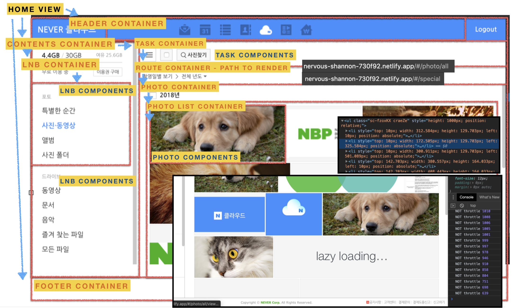

# 컨텍스트로 데이터 관리하기

## 컨텍스트란?

- [Context는 React 컴포넌트 트리 안에서 전역적(global)이라고 볼 수 있는 데이터를 공유할 수 있도록 고안된 방법이다.](https://ko.reactjs.org/docs/context.html)

## 왜 컨텍스트가 필요한가?

<a href="https://github.com/1ilsang/never-cloud"></a>

- 중첩이 깊은 컴포넌트까지 데이터를 내려줘야 할 때 모든 부모 컴포넌트들이 `props` 로 내리기엔 너무 큰 부담.

따라서 `Observable Pattern` 을 사용하여 `Provider` / `Consumer` 의 역할을 분리해 데이터를 Subscribe 하도록 한다.

- 데이터의 흐름을 관리할 필요 없이 구독만 시켜주면 데이터를 받아올 수 있게 된다.
- 즉 컴포넌트 간의 데이터 의존성이 사라진다.
- Consumer 가 Provider 의 값을 변경하고 싶다면 컴포넌트의 단방향 흐름과 같이 콜백 함수를 받아서 사용하도록 한다.(DDAU)
- DDAU(Data Down, Action Up): 데이터는 아래로, 변경 요청은 위로. 데이터의 일관성을 유지시킨다.

## Provider 동작 방식 알아보기

1. [HomePageWithProvider](https://github.com/justinpark/justin-do-it-react/blob/master/src/06/HomePageWithProvider.jsx)
2. [LoadingProvider](https://github.com/justinpark/justin-do-it-react/blob/master/src/06/LoadingProvider.jsx)
3. [ButtonWithLoadingContext](https://github.com/justinpark/justin-do-it-react/blob/master/src/06/ButtonWithLoadingContext.jsx)
4. [withLoadingContext](https://github.com/justinpark/justin-do-it-react/blob/master/src/06/withLoadingContext.jsx)

## ContextAPI 사용하기

```javascript
import React from "react";

const { Provider, Consumer } = React.createContext({});

/**
 * ContextAPI: Consumer code.
 *   function Consumer({ children }, context) { return children(context); }
 */
export { Consumer };

export default class LoadingProvider extends React.Component {
  constructor(props) {
    super(props);

    this.state = {};
    this.setLoading = this.setLoading.bind(this);
  }

  setLoading(key, value) {
    const newState = { [key]: value };
    this.setState(newState);
  }

  render() {
    const context = {
      ...this.state,
      setLoading: this.setLoading,
    };

    return <Provider value={context}>{this.props.children}</Provider>;
  }
}

/////////////////////////////////////////
function ButtonWithNewConsumer({ children }) {
  return (
    <Consumer>
      {(contextValue) => (
        <Button>{contextValue.loading ? "loading..." : children}</Button>
      )}
    </Consumer>
  );
}
////////////////////////////////////////
function Compo() {
  return (
    <LoadingProvider>
      <ButtonWithNewConsumer />
    </LoadingProvider>
  );
}
```

## 모달을 ContextAPI 로 제어하기

1. [ModalProvider](https://github.com/justinpark/justin-do-it-react/blob/master/src/06/ModalProvider.jsx#L34)
2. [Consumer](https://github.com/justinpark/justin-do-it-react/blob/master/src/stories/ModalStory.jsx#L39)
